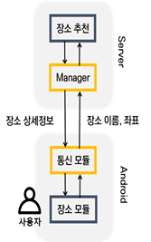
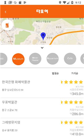
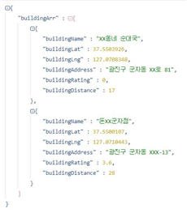
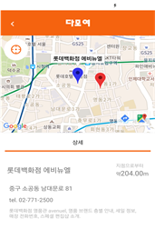
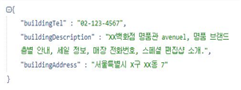

# DamoYeo

### 문제해결기법 1조 프로젝트

## 개요
시간 가중치 알고리즘(TOMSA)을 이용하여 도출된 중간지점의 주변 ?m 반경에 있는 약속 장소를 받아오기 위한 모듈을 만들자.

## 개발 언어 및 환경
* JavaScript
* Visual Studio Code

## 내용

구글에서 제공하는 Place API를 이용하여 중간 지점의 ?m 반경에 있는 약속 장소 후보들의 정보를 가져온다.

가져온 장소의 정보를 바탕으로 네이버 검색 API를 이용하여 추가 정보를 가져온다.

코드에 있는 각종 Key들은 개인적인 부분이기 때문에 삭제하였다.

## 모듈 흐름도

* 장소 추천 모듈 흐름도

* 건물 상세 정보 모듈 흐름도

## 장소 추천 결과 화면 및 API에서 얻어온 JSON 정보 Parsing 예시

* 장소 추천 결과 화면

* 구글 Place API에서 얻어온 JSON 정보를 알맞게 Parsing한 결과

## 건물 상세 정보 결과 화면 및 API에서 얻어온 JSON 정보 Parsing 예시

* 건물 상세 정보 결과 화면

* 네이버 지역검색 API에서 얻어온 JSON 정보를 알맞게 Parsing한 결과

## 어플 '다모여'의 데이터 흐름도

